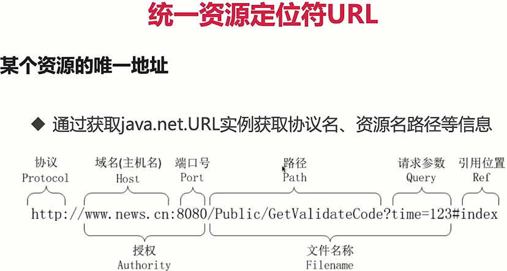

## 框架具备的基本功能

解析配置

定位与注册对象  

注入对象   

提供通用的工具类

## IOC容器的实现

需要实现的点

>创建注解-->提取标记对象 -->实现容器 -->依赖注入

提取标记对象思路：
>指定范围，获取范围内的所有类
>遍历所有类，获取被注解标记的类并加载进容器里

单例模式：
恶汉模式--线程安全

懒汉模式--加入双重检查锁机制可以确保线程安全

装备了内聚的恶汉模式能低于反射与序列化的进攻，满足容器需求

jad: http://www.javadecompilers.com/jad  class反编译过来的代码更清晰，比javap反编译的代码细节上更清晰   
class文件被jad反编译后生成对应的class文件名的jad文件，比如EnumStarvingSingleton.class 反编译后 EnumStarvingSingleton.jad

实现容器：

容器组成部分--保存class对象及其实例的载体；容器的加载；容器的操作方式；

实现容器的加载--配置的管理与获取；获取指定范围内的Class对象；一句配置提取Class对象，连同实例一并存入容器

实现容器的操作方式--增加、删除操作；根据Class获取对应的实例；
获取所有的Class和实例；通过注解来获取被注解标注的Class；通过超类获取对应的子类Class；
获取容器载体保存Class的数量；

spring框架有多种作用域： singleton, prototype, request, session, globalsession

实现容器的依赖注入   
实现思路：定义相关的注解标签； 实现创建被注解标注的成员变量，并将其注入到成员变量里； 依赖注入的使用；

系统需求
常规业务的缺陷：
>添加日志信息：为每个方法添加统计时间
>添加系统权限校验：针对某些方法进行限制
>OOP下必须得为每个方法添加通用的逻辑工作，增加维护成本

关注点分离 Concern Separation

不同的问题交给不同的部分去解决，每个部分专注解决自己的问题
>Aspect Oriented Programming 就是其中一种关注点分离的技术
>通用化功能的代码实现即切换Aspect
>Aspect之于AOP，就相当于Class之于OOP，Bean之于Spring

